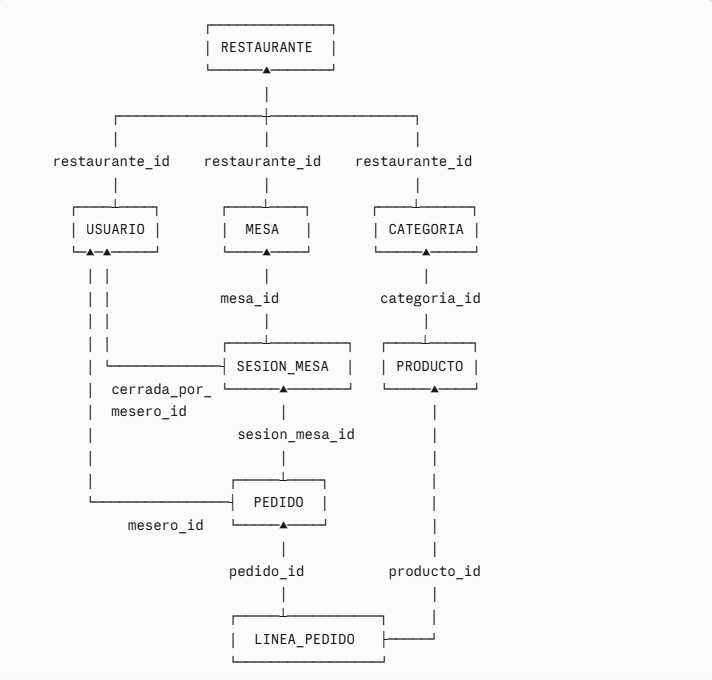

# Documento de diseño FINAL — App de pedidos QR para bares

**Versión:** definitiva, lista para empezar a programar el backend.
**Proyecto:** Software de pedidos en mesa por QR + comandero del mesero.
**Mercado inicial:** O Barco de Valdeorras y comarca.
**Stack:** PostgreSQL + Python (FastAPI) + frontend web.

---

## 1. EL PROBLEMA QUE RESUELVE

> *"Ayudo a bares con alta rotación a que sus meseros rindan más sin contratar a nadie, haciendo que los pedidos vayan directos del móvil del cliente a la cocina — así el camarero deja de gastar tiempo yendo a tomar nota y se dedica a servir y atender."*

**Dolor número uno del dueño:** que los meseros rindan más sin contratar (el personal es su mayor gasto).

**Frase de venta:** *"Tus camareros atienden más mesas sin contratar a nadie. Los clientes piden solos desde el móvil y el pedido cae directo en cocina."*

---

## 2. DECISIONES DE PRODUCTO

- **Dos puertas, mismo sistema:** QR del cliente + comandero del mesero, cayendo en la misma cocina.
- **MVP NO cobra ni factura.** El cobro lo hace el TPV del bar. Evita Verifactu.
- **Idiomas:** ES / EN / FR con selector de bandera desde el día uno.
- **Sin registro del cliente:** no se piden datos personales. Esquiva RGPD.
- **Diseño multi-tenant:** todo cuelga de restaurante. Cada bar es un subconjunto aislado.

---

## 3. EL "PROBLEMA DE LOS GRUPOS Y LOS PAGOS" — RESUELTO

### El problema

En un bar, en la misma mesa pueden darse varios escenarios distintos:

- **A. Refuerzos al mismo grupo:** llegan más amigos a una mesa que ya está comiendo.
- **B. Grupos que rotan:** un grupo come a las 14h y se va; otro grupo distinto llega a las 21h a la misma mesa.
- **C. Cuentas separadas dentro del mismo grupo:** alguien quiere pagar SU pedido aparte aunque esté sentado con otros.
- **D. Mesa comunal con grupos distintos a la vez:** dos parejas que no se conocen, en mesa larga, cada una con su cuenta.

Si la base de datos solo conoce "mesas" y "pedidos", todos esos casos se mezclan: imposible distinguir qué pidió cada grupo o cada persona.

### La solución elegida: la capa "sesion_mesa" como unidad de pago

Entre `mesa` y `pedido` se introduce una tabla intermedia llamada `sesion_mesa`. **Una sesión es una "unidad de pago"**: el conjunto de pedidos que se cobran juntos. Cada pedido pertenece a una sesión, no a la mesa directamente.

```
ANTES:  mesa  ────<  pedido
DESPUÉS: mesa ────<  sesion_mesa  ────<  pedido
```

### Decisión clave: VARIAS sesiones abiertas a la vez en la misma mesa

Inicialmente se pensó restringir a una sola sesión abierta por mesa (con un índice único parcial), pero esa restricción se quitó **a propósito**. Permitir varias sesiones abiertas simultáneamente en la misma mesa es lo que hace que los cuatro escenarios A-D se resuelvan **con un único concepto**, sin añadir más tablas (como "ticket", "comensal", etc.).

### Cómo se mapea cada escenario a sesiones

| Escenario | Solución con sesiones |
|---|---|
| **A.** Refuerzos al grupo | Todos pertenecen a la misma sesión abierta. Sin acción especial. |
| **B.** Grupos que rotan | Sesión 1 (grupo de mediodía) se cierra al cobrar. Sesión 2 (grupo de noche) se abre nueva. |
| **C.** Cuentas separadas | Sesión "del grupo" + sesión individual coexisten en la misma mesa hasta que cada una se cobra. |
| **D.** Mesa comunal | Dos sesiones distintas abiertas en paralelo en la misma mesa. |

### Apertura y cierre de sesiones

- **Apertura híbrida:**
  - *Automática:* si un cliente escanea el QR y no hay sesión abierta, la app abre una automáticamente.
  - *Manual:* el mesero o el cliente pueden abrir una sesión nueva si quieren pagar aparte.
- **Cierre solo manual:** la sesión se cierra cuando el mesero la marca como cobrada, no antes.

### Por qué esta solución es la correcta

- **Una sola idea cubre cuatro casos** en vez de añadir tablas y lógica nueva para cada uno.
- **Sin "ticket" ni "comensal":** no hace falta que el cliente escriba su nombre ni que la app gestione fusiones de tickets.
- **La división del total al pagar** (caso clásico: "47€ entre 4 son 11,75€") se resuelve como cálculo al cobrar, no en la estructura de datos.
- Es **extensible:** si algún día un bar pide algo más complejo, la estructura aguanta o se amplía con poco trabajo.

### El cambio técnico exacto

Una sola diferencia respecto a la versión anterior del SQL: **no se incluye el índice único parcial** que limitaría a una sola sesión abierta por mesa. Sí se mantiene un índice normal sobre `mesa_id` para que las consultas sean rápidas. Todo lo demás del esquema queda igual.

---

## 4. ESTRUCTURA DE DATOS FINAL — 8 TABLAS



### Resumen de tablas

| Tabla | Función |
|---|---|
| `restaurante` | El bar (multi-tenant root). |
| `usuario` | Dueño y meseros (con rol). |
| `mesa` | Mesa física con su `token_qr` único. |
| `categoria` | Secciones de la carta. Nombres en 3 idiomas. |
| `producto` | Platos/bebidas. Precio en céntimos, 3 idiomas, foto, `disponible`. |
| `sesion_mesa` | Unidad de pago. Varias pueden coexistir abiertas en la misma mesa. |
| `pedido` | Pedido dentro de una sesión. Estado, origen (cliente/mesero). |
| `linea_pedido` | Cada renglón del pedido. Precio congelado al pedir. |

### Decisiones de diseño aplicadas

- **Precios en céntimos (INTEGER)** — evita errores de redondeo.
- **Precio copiado en `linea_pedido`** — los pedidos antiguos conservan el precio del momento aunque cambie el del producto.
- **Multi-idioma con columnas por idioma** (nombre_es, nombre_en, nombre_fr) — simple y suficiente para 3 idiomas fijos.
- **`token_qr` único** — no se expone el número de mesa en la URL.
- **`password_hash`** — nunca contraseñas en claro.
- **Claves foráneas opcionales** donde aplica (`mesero_id` en pedido si lo pidió el cliente).
- **`CHECK` en campos de valores cerrados** (estado, origen, rol) — protege contra valores inventados por typo.
- **Índices en todas las claves foráneas** — rendimiento en consultas.
- **`ON DELETE` definido** — CASCADE donde tiene sentido, RESTRICT para proteger datos, SET NULL donde el dato sobrevive sin referencia.

---

## 5. FLUJO DE DATOS — CICLO DE VIDA DE UN PEDIDO

```
1. CLIENTE escanea el QR de la mesa.
2. App busca la mesa por su token_qr.
3. App comprueba si hay sesión abierta en esa mesa:
     ├── Si NO hay → abre sesión nueva (abierta_por='automatica').
     └── Si SÍ hay → puede unirse a la existente
                     o abrir una nueva si quiere pagar aparte.
4. CLIENTE elige productos y confirma su pedido.
5. INSERT en PEDIDO (sesion_mesa_id, origen='cliente', estado='recibido').
6. INSERT en LINEA_PEDIDO por cada producto (cantidad + precio copiado).
7. COCINA ve el pedido en su tablero (polling).
8. COCINA toca "en preparación" → UPDATE estado.
9. COCINA toca "servido" → UPDATE estado.
10. Cuando el grupo paga, MESERO cierra la sesión
    (UPDATE sesion_mesa: estado='cerrada', cerrada_en, cerrada_por_mesero_id).
```

El flujo del mesero (comandero) es idéntico a partir del paso 4, salvo que `origen='mesero'` y se rellena `mesero_id`.

---

## 6. REGLAS DE NEGOCIO (CERRADAS)

- Todo se agrupa por SESIÓN (no por mesa directamente).
- Cliente y mesero crean el mismo objeto pedido; cambia solo el `origen`.
- Pedido entra directo a cocina (estado 'recibido'). Sin paso de "aceptar".
- Cancelable solo en estado 'recibido'.
- Tiempo real por polling (no WebSockets en MVP).
- Sin bloqueo de mesas: dos meseros pueden trabajar la misma mesa.
- Sin validación de ubicación del QR.
- Si un producto se agota: cocina lo marca y avisa al mesero.

---

## 7. PASO ACTUAL Y PRÓXIMOS

### Completado
- Diseño funcional, flujos, decisiones de producto.
- Esquema SQL final cerrado (archivo `esquema-final.sql`).

### Siguientes pasos
1. Ejecutar el SQL final en `pedidos_bares`.
2. Meter datos de prueba sobre el esquema definitivo (incluyendo sesiones).
3. Practicar consultas con JOINs sobre la cadena completa
   (linea_pedido → pedido → sesion_mesa → mesa → restaurante).
4. Diseñar los endpoints de la API en papel.
5. Empezar el backend en Python (FastAPI).

---

## 8. ARQUITECTURA TÉCNICA

```
┌─────────────────────┐
│ Móvil cliente       │  ← web pública, sin instalar
├─────────────────────┤
│ Móvil mesero        │  ← web + login (cualquier móvil)
├─────────────────────┤  ─────► Backend FastAPI ─────► PostgreSQL
│ Tablet cocina       │
├─────────────────────┤
│ Panel dueño         │
└─────────────────────┘
```

### Versión 2 (fuera del MVP)
- Descripciones de platos traducidas con IA.
- Analítica del negocio (qué se vende, horas, días).
- Ordenar la carta arrastrando.
- Pagos integrados (implica Verifactu — proyecto aparte).
- Modo offline del comandero.
- Cuentas individuales más sofisticadas si el mercado lo pide (la base actual con múltiples sesiones ya cubre el 95% de casos reales).
